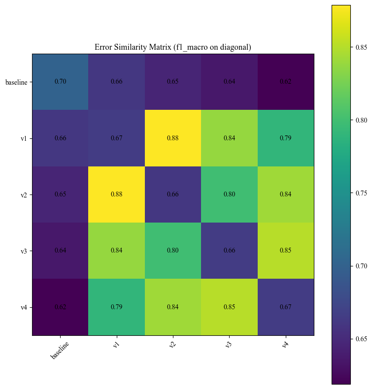
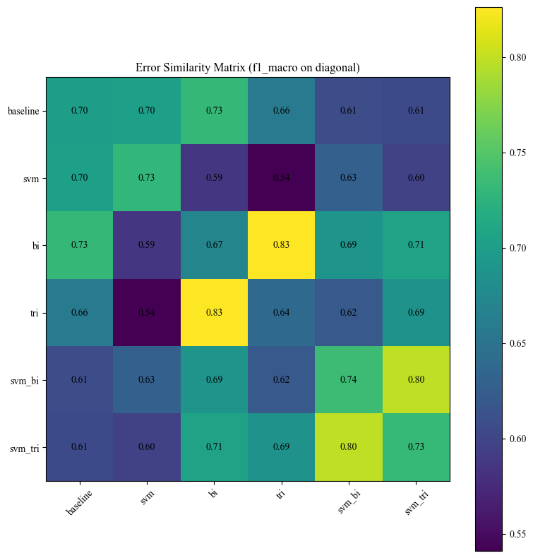
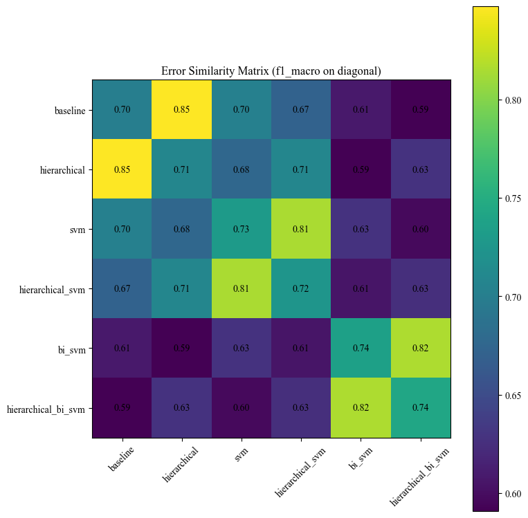

# Analiza błędów i poprawnie klasyfikowanych przykładów

- Wszystkie przytoczone przykłady pochodzą ze **zbioru walidacyjnego.**
- Przy analizie przykładów, popełnianych błędów i ogólnych trendów w datasecie posłużyłam się pomocą LLM'a, gdyż był on w stanie przeanalizować więcej klasyfikowanych tekstów niż jeden człowiek.
- **Uwaga:** W dalszej części opracowanie znajdują się przykłady tekstów zawierających treści dotyczące zdrowia psychicznego, depresji, kryzysów emocjonalnych oraz zachowań suicydalnych.

## Eksperyment 1: wpływ preprocessingu

Poniższa macierz przedstawia podobieństwo błędów (mierzone **współczynnikiem Jaccarda**) pomiędzy modelami wykorzystującymi różne warianty preprocessingu. Wartości poza przekątną pokazują, **jak często modele mylą się na tych samych przykładach**.

* **Wszystkie warianty preprocessingowe popełniają bardzo podobne błędy** (współczynniki Jaccarda w zakresie `0.79–0.88`).
* Najbardziej podobne są pary `v1–v2` (`0.88`) oraz `v3–v4` (`0.85`), co sugeruje, że **tokeny niealfanumeryczne nie są specjalnie istotne w badanym datasecie**.
* Baseline najmocniej różni się od pozostałych wariantów (`0.62–0.66`), co sugeruje, że **preprocessing istotnie zmienia sposób podejmowania decyzji przez model**, niestety niekoniecznie na lepsze.

---

**PRZYKŁAD 1:**

    When I get told I am a good guy it sometimes drives me near to tears. I have been told how nice I am. How funny I am. How dependable. I have been told many times by different people these things so it must be true right? But I guess I am not good enough. If I was it would not be so hard to find and keep people in my life. I know it sounds self serving and all pity party but its how I feel and the thoughts in my head. I realize and understand that I am not a priority to anyone else. I just wish I knew there was someone out there who thought of me sometimes. A complement upsets me...

TRUE: `Depression`

Wszysktie warianty: `POPRAWNIE`

ANALIZA: 

Przykład zawiera liczne charakterystyczne sygnały depresji związane z **niską samooceną, samotnością i poczuciem bezwartościowości**. Wszystkie warianty poprawnie rozpoznały klasę, co sugeruje, że nawet prosty model TF-IDF dobrze radzi sobie z tekstami zawierającymi wyraźne emocjonalne słownictwo.

---

**PRZYKŁAD 2:**

    Can’t take it anymore Today has been one of the worst days in a long time. Out of so many countless times I have wanted to just give up and end it, I kept going. Thought I was getting a loan so I could get out of debt and actually have some money to get things I desperately need since I haven’t worked in over 5 months and have had $0 since. I recently got a lawyer to try and get SSI and last week I finally found out how to apply for General aid since months ago the welfare office wouldn’t tell me how to and kept saying they only had it for families. So the loan company that pretty much got all of my info and bank turned out to be scammers and Citibank is absolute trash and their fraud department is shit. So if I wasn’t already experiencing enough stress and severe depression life decided to give me that too. Then today Sunday I have been looking forward too because I was finally going to see my FwB that I haven’t seen in quite some time and I really like him/fallen for him. And even more excitement was besides just hooking up he invited me to AX throwing so I just felt so giddy but he informed me tonight that he had to cancel due to something about his ex/custody issues. So here I am completely broken in every way and tired to keep living. I really can’t keep trying/going. I need to get off of this ride called life…. 😞

TRUE: `Bipolar`

Wszystkie warianty: `BŁĘDNIE`
- baseline, v1, v2: `Depression`
- v3, v4: `Suicidal`

ANALIZA: 

Przykład pokazuje **ograniczenie samego tekstu jako źródła informacji**. Wypowiedź zawiera bardzo silne sygnały depresji i myśli samobójczych, natomiast praktycznie nie zawiera charakterystycznych symptomów choroby dwóbiegunowej. Lematyzacja w uwzględnieniem częsci mowy (v3 i v4) wzmocniła sygnały związane z klasą `Suicidal`, co sugeruje, że uwydatniły się w ten sposób fragmenty dotyczące utraty nadziei i rezygnacji z życia.

---

**PRZYKŁAD 3:**

    i always make mistakes, and bad decisions. i have no skills or talents. i have no accomplishments. i feel like a useless person. my parents make me feel stupid, for every mistake that i make. i feel like I will never be where i want to, because i cannot do simple thing. i never feel like I am good enough. i feel like a stupid person that will never amount to anything. i feel worthless 99% of the time.

TRUE: `Suicidal`

Wszystkie warianty: `BŁĘDNIE` (`Depression`)

ANALIZA:

Modele sklasyfikowały przykład jako `Depression`, ponieważ tekst koncentruje się głównie na **niskiej samoocenie i poczuciu bezwartościowości**. Mimo że etykieta należy do klasy `Suicidal`, wypowiedź **nie zawiera bezpośrednich odniesień do samobójstwa** ani chęci odebrania sobie życia. Pokazuje to silne semantyczne nakładanie się obu klas.

---

**PRZYKŁAD 4:**

    Hey guys, I am currently in the progress of wring a research plan for my internship. I am doing a project on the effects of scaring trials on eurasian cranes on agricultural fields. However, English is not my native language and i am having trouble coming up with a catchy head title. It has to be catchy and short but not too corny.

TRUE: `Normal`

Klasyfikacje:
- baseline: `Depression`
- v1, v2, v3, v4: `Normal`

ANALIZA:

Bazowy model błędnie sklasyfikował neutralny tekst jako `Depression`, prawdopodobnie reagując na **pojedyncze słowa o negatywnym wydźwięku, takie jak “trouble” czy “scaring”**. Warianty z preprocessingiem poprawnie rozpoznały neutralny charakter wypowiedzi, co sugeruje, że **oczyszczanie tekstu może pomagać w ograniczaniu wpływu przypadkowych słów emocjonalnych**.

---

**PRZYKŁAD 5:**

    suicidal all weekend watched the infamous funky town gore video i m usually ok with gore and death but that wa horrific made me think could that be me in hell for eternity i mean if human could do something that drawn out and horrific there s no telling what would be in store down there and all because i couldn t handle the cruelty of human nature

TRUE: `Depression`

Klasyfikacje: tylko baseline `POPRAWNIE` (v1, v3: `Normal`)

ANALIZA:

Przykład pokazuje, że agresywniejszy preprocessing **może usuwać istotne sygnały emocjonalne obecne w nieformalnym języku internetowym**. Bazowy model poprawnie rozpoznał klasę `Depression`, natomiast warianty z preprocessingiem utraciły część informacji wynikającej z **chaotycznego stylu wypowiedzi** i błędnie sklasyfikowały tekst jako `Normal`.

---

## Eksperyment 2: mocniejszy model, szerszy kontekst

Kolejna macierz przedstawia podobieństwo błędów pomiędzy modelami wykorzystującymi **różne klasyfikatory** (`LogisticRegression`, `LinearSVC`) oraz **różne zakresy kontekstu w TF-IDF** (unigramy, bigramy, trigramy).

- **Najbardziej podobne błędy** popełniają warianty Bigram i Trigram (`0.83`) oraz Bigram SVM i Trigram SVM (`0.80`), zatem w ubu przypadkach dalsze rozszerzanie kontekstu nie przynosiło istotnych zmian (poza wydłużeniem czasemu obliczeń).
- Baseline jest najbardziej zbliżony do wariantu opartego o bigramy (`0.73`), ale zauważalnie różni się od modeli używających SVM (`0.61–0.70`).
- Największe różnice występują ***między SVM i modelem liniowym używającym trigramów w TF-IDF** (`0.54`), co sugeruje, zmiany te różnorodnie wpływają na charakter błędów.
- **Modele SVM zmieniają rozkład błędów bardziej niż samo rozszerzenie zakresu n-gramów.** 

---

**PRZYKŁAD 1:**

    What's the worst part about being stressed constantly? We all obviously understand that stress isn't healthy. But each of us experiences stress differently. What's the worst part about being stressed for you?

TRUE: `Stress`

Wszysktie warianty: `POPRAWNIE`

ANALIZA:

Przykład zawiera **bezpośrednie odniesienia do stresu** oraz pytanie o doświadczenia związane ze stresem. Wszystkie modele poprawnie rozpoznały klasę `Stress`, co sugeruje, że **krótkie i jednoznaczne wypowiedzi są stosunkowo łatwe do klasyfikacji**.

---

**PRZYKŁAD 2:**

    Just fucking why. I am trying. I am giving my best. I did not self harm for almost a month. I am giving negativity away. I cutted off my ex friends. I got a better relationship with my mother. I stopped telling every little shit to my friends. I started to stop creating drama. I started being useful. Cleaning. Reading. Behaving. My mother loves me. Everybody loves me. Everybody fucking loves me. But why. When i take a look down inside me i still see the black, and the sadness. And the urge to hirt myself. And i think that its fine. Its alright. I put on happy music, a happy face and I am fine. But a minute later i want to fucking cry. And I am getting anxious. My schizophrenia illusions are fucking hell. Imagine this : being 12:00 in the night, trying to sleep, in your bed, your mom's asleep, and you see running to you a fucking dead bride with her head twisted and her hands ready to grab you. And when you are about to scream you realise its just your imagination. Your dumb fucking imagination. Then you start panicking randomly. And more. You feel hungry but do not eat all day because you are fat when you are not. Always compare yourself to the others. And create temporary smiles and happines. And later you are hurt again. And getting betrayed. By the ones who sais they would never do that. And emotional abuse. Bullying. And way fucking more. I am trying. I am really fucking trying but life fucking sucks. And its getting worse while its fine. Everyone starts replacing you, leaving you, getting dissapointed in you, while you try your fucking best. And when you tell someone they say its just the hormones. Will it be still just the hormons when i jump off the balcony too? Everyday i look at it, and ask myself if i should. I punch my face and go back to what i was doing. Or cutting myself. I just cannot. A few weeks ago i did my first cut/s to blood. They hurt. And stinged. Really bad. But the pain in my head abd chest was not as big as before. I did not do anymore cuts till then. I have the urge to do everytime, even now, but i just do not. I just, cannot. I cannot do this. I am still trying. I am still fucking trying to find the hope that does not exist. Nothing happens. I do not want to die. No one does. Everyone wants to live. And the ones that die, they did not want to. They wsnted it to get better. It did not. It never did. So, they did not have any other choice. Neither do i. But I am still fucking trying. And nothing gets better. I will soon surely come back to self harm. I am sorry. Why me. Why this. Why. JUST FUCKING WHY.

TRUE: `Suicidal`

Wszysktie warianty: `POPRAWNIE`

ANALIZA:

Wszystkie modele poprawnie sklasyfikowały **bardzo długi i silnie emocjonalny** tekst jako `Suicidal`. Wypowiedź zawiera **liczne odniesienia do samookaleczania, utraty nadziei i myśli samobójczych**, dzięki czemu nawet proste modele TF-IDF były w stanie uchwycić dominujący charakter emocjonalny tekstu.

---

**PRZYKŁAD 3:**

    We are investigating social anxiety, perfectionism, and thinking styles, and we are interested in your insight. Hi everyone, I'm a PhD candidate in clinical psychology and I'm currently conducting a survey on social anxiety, perfectionism, and thinking styles. I would love to hear from you! The survey is open to anyone aged 18+. It should take about 30 mins to complete, and you have the option to enter a 1 of 4 $50 Visa gift card draw at the end.

    Link to the survey: https://qualtrics.flinders.edu.au/jfe/form/SV_cVfmOOF57d75gHj Thanks!

TRUE: `Bipolar`

Wszystkie warianty: `BŁĘDNIE`
- baseline, trigram, SVM, SVM trigram: `Stress`
- bigram: `Normal`
- SVM bigram: `Depression`

ANALIZA:

Tekst praktycznie **nie zawiera informacji o stanie psychicznym autora i ma charakter neutralnego ogłoszenia**. Wszystkie modele błędnie sklasyfikowały przykład, co sugeruje możliwy **problem z jakością etykiet w zbiorze danych**. W takich przypadkach model nie ma wystarczających informacji, aby poprawnie przewidzieć klasę.

---

**PRZYKŁAD 4:**

    should i force myself to talk when i am unable to? //vent, about work and conflict with friend + my issues // i was having a conversation with a close friend of mine about work settings because i will be having an internship soon. we talked about standard work things and tips, but then it lead to talking about my anxiety.

    i asked, "if i'm unable to speak because of anxiety, how do i communicate that to them?" 'them' being my coworkers. for extra context, i think this is a common thing but just in case, my throat closes up to a degree that it becomes hard to and painful to breathe or speak. obviously i need to breathe, so i've learned to tough through it, and even so i was able to get an appointment with someone who may be able to help this issue. as for speaking, that can be even more painful than breathing, so i usually try to tap my throat with my finger and hold up one finger with the other hand to try to communicate that i need a minute and i can't breathe/speak.

    i was worried that may not be enough, and i had previously told my friend about my issues. i figured he'd be the right guy to ask, especially since he's training to become a therapist. i guessed he may have some ideas i haven't thought about yet

    he told me to tell my coworkers i need a minute to think and to maybe say it directly. i asked him, "if i can't talk, how do i say it to them directly?" i'm bad with conveying tone, partially because i'm autistic, so i can see in hindsight that it may have come off wrong.

    he asked me if i was just going to leave or stay quiet without telling them what was going on, and he also said that the situation would just become worse. i was starting to get a bit upset and i said that i knew that. *then he told me to learn how to force myself to say it.*

    that's where i became really upset. i have no idea if this was justified or not, all i know is how much it hurt. i tired my best to remind him of some of my tics, and how if i'm stressed enough to be unable to speak, forcing myself would DEFINATELY make the situation worse. i told him about how there's been times where i've gotten overwhelmed and anxious, which led to me accidently hitting someone rarely or most commonly myself. sometimes i'll have really bad ones which make me yell, fling my arm beside my head, or slam a fist down on a table.

    i then apologized. he then told me that it's unfair, but i have to vocalize that kind of thing. i worked some things out with another close friend of mine, and we both agreed that i should maybe carry around some laminated cards on a ring with common words and sayings to help me communicate. we also talked about telling my coworkers and employers beforehand about my issues, and how i need a few minutes to myself to calm down.

    i tried messaging the friend from before, saying that i wanted to talk. i apologized for getting upset and explained that i was hurt by what he said and that i was hoping we can talk about it all. i apologized again. i've seen he's read the message, but he hasn't responded. i'm a bit worried, but trying to be patient with out differing time zones.

    should i force myself to talk when i am unable to, especially with some of my issues? i want to believe i'm not at fault, but i feel horrible about getting upset and i'm wondering if he's right and i should just try to suck it up.

    **edit:** i also worry that i may have overreacted and blown up over something unimportant. it's just so infuriating and hurtful because i've been told all my life to force myself to do things and to just toughen up and deal with it. i've been called overly emotional and at this point any slight indication someone thinks that way kind of sets me off. i'm sorry if this doesn't make much sense, i struggle putting these things into words.

TRUE: `Anxiety`

Wszystkie warianty: `BŁĘDNIE`
- baseline, bigram: `Stress`
- trigram, SVM, SVM bigram, SVM trigram: `Depression`

ANALIZA:

Przykład pokazuje silne semantyczne nakładanie się klas `Anxiety`, `Stress` i `Depression`. Wypowiedź **zawiera zarówno objawy lękowe, jak i elementy chronicznego stresu oraz emocjonalnego wyczerpania**. Modele miały **trudność z wyodrębnieniem dominującej kategorii**.

---

**PRZYKŁAD 5:**

    Stress symptoms?? So I’ve been so stressed recently. Had the worst anxiety for the past 2 weeks. First it was eye pain now it’s back pain and side pain. I was worried so I went to the ER. They did blood work and checked if I had a uti or a certain std. everything came back normal. Very confused. Can anyone relate?

TRUE: `Stress`

Wszystkie warianty: `BŁĘDNIE` (`Anxiety`)

ANALIZA:

Wypowiedź zawiera liczne odniesienia do **lęku i objawów psychosomatycznych**, co pokazuje, że granica między stresem a zaburzeniami lękowymi jest w praktyce bardzo płynna. Możliwe jest też, że **frazy związane z wizytami lekarskimi** są silnie powiązane z klasą `Anxiety`, co przeważyło o decyzji modeli.

---

## Eksperyment 4: klasyfikacja hierarchiczna

Przedstawiona macierz obrazuje podobieństwo błędów pomiędzy modelami klasyfikującymi teksy bezpośrednio oraz hierarchicznie.

* Wprowadzenie klasyfikacji hierarchicznej zmienia charakter błędów stosunkowo niewiele — modele hierarchiczne **nadal mylą się głównie na tych samych przykładach** co warianty bezpośrednie.
* Większe różnice widoczne są między modelami bazowymi a wariantami SVM (`0.59–0.70`), co sugeruje, że **wybór klasyfikatora wpływa na błędy bardziej niż sama strategia hierarchiczna**.
* Hierarchiczne warianty SVM bardziej różnią się od swoich odpowiedników bezpośrednich (`0.81` oraz `0.82`), niż ma to miejsce w przypadku klasyfikatora `LogisticRegression` (`0.85`).

---

**PRZYKŁAD 1:**

   Mold was growing by my bed for months it seems I’m worried... Today I noticed a black blotch sticking from the side of my bed today, so I lifted my mattress and discovered black like mold and mildew. I’m super worried because that would mean I been exposed to it for awhile and I’m worried I may have any possible brain damage from it. I immediately destroyed it with bleach but I’m worried I have long term effects from exposure please help

TRUE: `Anxiety`

Wszysktie warianty: `POPRAWNIE`

ANALIZA:

Tekst zawiera bardzo **charakterystyczne objawy lękowe związane z nadmiernym zamartwianiem się o zdrowie** i potencjalne zagrożenia.

---

**PRZYKŁAD 2:**

    tayswift i wa up at am btw congrats on winning album of the year you deserve it i can t not shed a tear to white horse

TRUE: `Normal`

Wszysktie warianty: `POPRAWNIE`

ANALIZA:

**Krótki, nieformalny i emocjonalnie neutralny** wpis został poprawnie sklasyfikowany jako `Normal`. Wykazuje się on dużą chaotycznością, ale nie spowodowało to zmylenia modeli.

---

**PRZYKŁAD 3:**

    Coping mechanisms for trigger scenario I've had nightmare neighbors which my housing have ignored for years the ball is finally rolling but I'm freaking out as they are having the housing officer in question and community officer who doesn't speak up about things they said that were incorrect previously to come for this talk, where were going to discuss their failings.

    Injustice and lying really trigger my anxiety and emotion regulation so I'm wondering what I could do in this meeting to relax? Right now all I can think of is music in one ear and camomile tea

TRUE: `Anxiety`

Wszystkie warianty: `BŁĘDNIE`
- baseline, hierarchical, hierarchical SVM, SVM bigram, hierarchical SVM bigram: `Stress`
- SVM: `Depression`

ANALIZA:

Modele błędnie sklasyfikowały tekst głównie jako `Stress`, ponieważ wypowiedź koncentruje się na **stresującej sytuacji interpersonalnej i napięciu emocjonalnym**. Mimo obecności słowa “anxiety”, **dominujący kontekst dotyczy radzenia sobie ze stresem i konfliktami społecznymi**. Mylące mogły być też dla modeli słowa takie jak "trigger", "relax", "music" czy "tea", które mogą być silnie reprezentowane w tekstach powiązanych ze stresem czy depresją (np. w kontekście prób samopomocy czy otrzymywanych rad).

---

**PRZYKŁAD 4:**

    Going to sleep crying at the thought of waking up crying do not let me wake up

TRUE: `Suicidal`

Wszystkie warianty: `BŁĘDNIE`
- baseline, hierarchical, SVM, hierarchical SVM: `Normal`
- SVM bigram, hierarchical SVM bigram: `Depression`

ANALIZA:

**Krótka i metaforyczna** wypowiedź okazała się bardzo trudna dla modeli. Tekst nie zawiera bezpośrednich odniesień do samobójstwa, dlatego większość wariantów sklasyfikowała go jako `Normal` lub `Depression`. Przykład pokazuje ograniczenia modeli opartych na TF-IDF w interpretowaniu **subtelnych i niejawnych sygnałów emocjonalnych**.

---

**PRZYKŁAD 5:**

    I am so damn scared of my therapist I heard avoidants are reluctant to seek therapy...

    Well, in 2021 I had a very hard time struggling with my mental health (I have ocd). I scheduled therapy 3 times with 3 different therapists and unscheduled it before every appointment because I couldn't gather the courage to go, I could not stand the fear of being judged and exposing my vulnerability like that, I felt so ashamed I wanted to vanish.

    Anyway... currently, I am on meds for my ocd because I finally managed to go to a psychiatrist.  
    However, I don't wanna be on meds forever, so I started therapy too.

    It has been 3 sessions so far and I am seriously considering leaving. Although I see how this can be helpful, I cannot stand the shame it brings me to talk about myself like that. It doesn't matter how many times the therapist says he won't judge me and understands me. My brain tells me that is absolutely impossible.

    To make it worse, I cried last time on therapy because I was talking about some very personal struggles. This made me even more ashamed.

    The therapist lives near my house and as fucked up as that sounds I am so scared to walk near the place where he lives and cross him on the street (it happened once)..... yesterday I was there and felt as if I was gonna faint, not exaggerating. The shame is unbelievable.

    My next session is on Friday... today is Wednesday... oh dear God I can't believe I am paying to feel like this. 

    I can't even tell if his approach is the problem or if it is just my avoidance. Honestly I think I'd feel like this with any therapist.

TRUE: `Personality disorder`

Wszystkie warianty: `BŁĘDNIE` (`Bipolar`)

ANALIZA:

Wypowiedź zawiera **silne emocje, lęk i trudności interpersonalne**, jednak **nie zawiera jednoznacznych symptomów zaburzeń osobowości**. Wszystkie modele sklasyfikowały tekst jako `Bipolar`, co pokazuje **trudność w rozpoznawaniu rzadkich i słabiej zdefiniowanych klas**.

---

## Wnioski ogólne

### A) Charakterystyka zbioru danych

Analiza błędów pokazuje, że kluczowym problemem nie była sama architektura modeli, lecz charakter datasetu. Klasy takie jak `Depression`, `Suicidal`, `Stress` i `Anxiety` silnie nakładają się semantycznie, a granice między nimi często są nieostre. Wiele wypowiedzi jednocześnie zawiera sygnały depresji, lęku, stresu czy kryzysu suicydalnego, co prowadzi do licznych, ale często semantycznie uzasadnionych pomyłek.

Najtrudniejsze do rozróżnienia okazały się klasy:

* `Depression`,
* `Suicidal`,
* `Bipolar`.

W praktyce wpisy oznaczone jako `Suicidal` często językowo przypominały ciężką depresję, natomiast przykłady klasy `Bipolar` nie zawsze zawierały charakterystyczne objawy choroby afektywnej dwubiegunowej. Sugeruje to, że część etykiet mogła wynikać bardziej z kontekstu źródła danych (np. subredditów lub kategorii forum) niż wyłącznie z treści samej wypowiedzi.

Dodatkowym utrudnieniem była jakość danych:
* część wpisów była bardzo krótka lub pozbawiona kontekstu,
* wiele tekstów zawierało slang, błędy językowe i chaotyczny styl charakterystyczny dla social mediów,
* niektóre etykiety wydawały się nie do końca zgodne z treścią wypowiedzi.

Jednocześnie dataset zawierał również wiele bardzo jednoznacznych przykładów. Wszystkie modele dobrze rozpoznawały wpisy z wyraźnym słownictwem emocjonalnym, szczególnie dla klas `Depression`, `Suicidal` oraz `Normal`.

---

### B) Ogólne trendy obecne we wszystkich wariantach modelu

Wszystkie modele raczej dobrze radziły sobie z przykładami zawierającymi bardzo charakterystyczne słownictwo emocjonalne. Wpisy zawierające wyrażenia takie jak:

* *“kill myself”*,
* *“hopeless”*,
* *“panic attack”*,
* *“worthless”*

były zazwyczaj poprawnie klasyfikowane do odpowiednich klas.

Najczęstsze błędy pojawiały się natomiast wtedy, gdy kilka klas częściowo nakładało się znaczeniowo. Szczególnie trudne było rozróżnienie:

* `Depression` ↔ `Suicidal`,
* `Stress` ↔ `Anxiety`,
* `Depression` ↔ `Bipolar`.

Przykładowo wpis oznaczony jako `Depression` mógł zostać sklasyfikowany jako `Suicidal`, jeśli zawierał wzmianki o śmierci lub samookaleczaniu. Analogicznie teksty opisujące trudne sytuacje życiowe często trafiały do klasy `Anxiety`, ponieważ zawierały słownictwo związane z lękiem i stresem.

W praktyce oznacza to, że wiele błędów modeli było semantycznie „rozsądnych”, ponieważ same dane zawierały niejednoznaczne sygnały emocjonalne.

Widoczna była również silna zależność modeli od słów-kluczy. Neutralne pytania lub zwykłe dyskusje bywały błędnie klasyfikowane jako `Suicidal` albo `Depression`, jeśli pojawiały się w nich pojedyncze emocjonalne słowa. Pokazuje to, że modele często reagowały bardziej na charakterystyczne tokeny niż na pełny kontekst wypowiedzi.

Ogólnie wszystkie modele osiągały zbliżone rezultaty jakościowe, a różnice między nimi dotyczyły głównie sposobu rozkładu błędów, a nie całkowitej skuteczności klasyfikacji.

---

### C) Obserwacje związane z użyciem silniejszego preprocessingu

Eksperymenty preprocessingowe pokazały, że bardziej agresywne oczyszczanie tekstu raczej pogarszało wyniki klasyfikacji. Usuwanie tokenów niealfanumerycznych oraz lematyzacja powodowały utratę części informacji stylistycznych obecnych w języku internetowym.

Dotyczyło to szczególnie:

* niestandardowej interpunkcji,
* powtórzeń,
* chaotycznego zapisu,
* emocjonalnego sposobu pisania.

W efekcie modele po mocniejszym preprocessingu czasami gorzej rozpoznawały silnie emocjonalne wypowiedzi. Pokazuje to, że w danych z social mediów sama forma wypowiedzi niesie istotną informację.

Jednocześnie preprocessing przynosił częściowe korzyści:

* ograniczał liczbę fałszywych alarmów dla klasy `Normal`,
* zmniejszał nadwrażliwość modeli na pojedyncze negatywne słowa,
* poprawiał rozpoznawanie bardziej neutralnych wpisów.

Wyniki sugerują więc, że w tego typu zadaniach NLP zbyt agresywne oczyszczanie danych może prowadzić do utraty istotnych sygnałów emocjonalnych, mimo że częściowo poprawia odporność modeli na szum.

---

### D) Wnioski dotyczące użycia mocniejszego modelu i szerszego kontekstu

Modele SVM lepiej wykorzystywały lokalny kontekst wypowiedzi niż prosty baseline oparty na `TF-IDF + Logistic Regression`. Szczególnie widoczne było to dla klas:

* `Stress`,
* `Normal`.

W kilku przypadkach SVM poprawnie klasyfikował wpisy stresowe zamiast przypisywać je do `Anxiety`, a także skuteczniej rozpoznawał neutralne teksty.

Jednocześnie nawet bardziej złożone modele nadal miały problem z niejednoznacznością semantyczną. Krótkie lub nietypowe wpisy często były błędnie przypisywane do `Depression`, ponieważ modele traktowały tę klasę jako najbardziej „bezpieczną” kategorię emocjonalną.

Widoczna była również różnica charakteru błędów:

* baseline był bardziej zachowawczy i częściej wybierał klasę `Depression`,
* modele mocniejsze i bardziej „czułe” częściej wykrywały `Suicidal`, ale generowały też więcej fałszywych alarmów.

Ostatecznie wyniki pokazują, że dalsza poprawa jakości klasyfikacji prawdopodobnie wymagałaby:

* lepszych etykiet,
* dodatkowego kontekstu użytkownika lub rozmowy,
* modeli uwzględniających szerszy kontekst semantyczny,
* albo redefinicji części klas w datasetcie.

---

### E) Analiza klasyfikacji bezpośredniej vs. hierarchicznej

Klasyfikacja hierarchiczna (zwłąszcza z szerszym kontekstem) częściowo poprawiała wykrywanie wpisów kryzysowych i problematycznych emocjonalnie. Dzięki temu modele te częściej poprawnie identyfikowały teksty związane z samobójstwem lub bardzo silnym kryzysem emocjonalnym.

Efektem była jednak większa liczba fałszywych alarmów:

* teksty zawierające pojedyncze odniesienia do śmierci lub kryzysu częściej trafiały do klasy `Suicidal`,
* krótkie lub niejednoznaczne wypowiedzi częściej były uznawane za patologiczne.

W porównaniu z nimi baseline działał bardziej zachowawczo i częściej przypisywał klasę `Depression`, traktując ją jako „bezpieczniejszą” kategorię pośrednią.

Hierarchiczny podział klasyfikacji pomagał więc częściowo uporządkować problem, ale nie eliminował głównych trudności wynikających z charakteru danych— przede wszystkim silnego nakładania się klas oraz niejednoznaczności emocjonalnej tekstów.

---