# Podsumowanie wyników

## Baseline (na zbiorze walidacyjnym)

| Klasa | Precision | Recall | F1-score | Support |
|---|---:|---:|---:|---:|
| Anxiety | 0.82 | 0.70 | **0.76** | 576 |
| Bipolar | **0.88** | 0.62 | 0.72 | 416 |
| Depression | 0.69 | 0.75 | 0.72 | 2311 |
| Normal | 0.86 | **0.95** | **0.90** | 2451 |
| Personality disorder | **0.88** | **0.46** | 0.61 | 162 |
| Stress | 0.64 | **0.44** | **0.52** | 388 |
| Suicidal | 0.70 | 0.67 | 0.68 | 1598 |
|  |  |  |  |  |
| Macro avg | 0.78 | 0.65 | **0.70** | 7902 |
| Weighted avg | 0.76 | 0.76 | **0.76** | 7902 |

Bazowy wariant modelu (`TF-IDF + Logistic Regression`) osiągnął dokładność (*accuracy*) `76%` oraz `F1-score macro avg = 0.70`, co wskazuje na umiarkowanie dobrą skuteczność klasyfikacji przy jednocześnie wyraźnym zróżnicowaniu jakości pomiędzy klasami.

Najlepiej rozpoznawaną klasą było `Normal` (`F1 = 0.90`), co wynika zarówno z dużej liczby przykładów, jak i stosunkowo charakterystycznego słownictwa neutralnych wypowiedzi oraz tego, że są one zwykle znacznie krótsze. Dobre wyniki osiągnięto również dla klas `Anxiety` (`0.76`) oraz `Bipolar` i `Depression` (`0.72`).

Największe trudności pojawiły się dla klas:

* `Stress` (`F1 = 0.52`),
* `Personality disorder` (`F1 = 0.61`),
* `Suicidal` (`F1 = 0.68`).

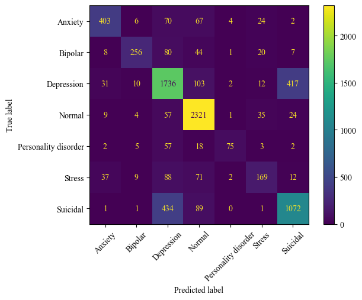

Analiza macierzy pomyłek pokazuje, że model najczęściej mylił:

* `Depression` z `Suicidal` (`417` przypadków),
* `Suicidal` z `Depression` (`434` przypadki),
* `Anxiety` z `Depression` oraz `Normal`.

Wskazuje to na silne nakładanie się części klas oraz dużą zależność modelu od **wspólnego słownictwa związanego z depresją, stresem i kryzysem emocjonalnym**. Widoczne jest również, że model ma tendencję do częstego wybierania klasy `Depression` jako **kategorii pośredniej dla trudniejszych lub niejednoznacznych przykładów**.

---

`UWAGA`: wszysktie wyniki z eksperymentów wyznaczone są na **zbiorze walidacyjnym**

## Eksperyment 1

| Preprocessing | Accuracy | F1-score (macro avg) | F1-score (weighted avg) | Precision (macro avg) | Precision (weighted avg) | Recall (macro avg) | Recall (weighted avg) |
|---|---:|---:|---:|---:|---:|---:|---:|
| Baseline | 0.76 | 0.70 | 0.76 | 0.78 | 0.76 | 0.65 | 0.76 |
| V1 | 0.74 | 0.67 | 0.73 | 0.77 | 0.74 | 0.61 | 0.74 |
| V2 | 0.73 | 0.66 | 0.73 | 0.78 | 0.74 | 0.61 | 0.73 |
| V3 | 0.74 | 0.66 | 0.73 | 0.76 | 0.74 | 0.62 | 0.74 |
| V4 | 0.74 | 0.67 | 0.73 | 0.77 | 0.74 | 0.61 | 0.74 |

Eksperymenty preprocessingowe pokazują, że **dodatkowe oczyszczanie tekstu pogorszyło jakości klasyfikacji względem wariantu bazowego**. Warianty z silniejszym preprocessingiem uzyskały wyniki niższe o około `0.03–0.04` punktu F1 macro. Różnice w weighted avg były mniejsze, co sugeruje, że preprocessing **najmocniej wpływał na klasy trudniejsze i mniej liczne**.

Wyniki wskazują, że agresywniejsze oczyszczanie tekstu prowadziło do **utraty części informacji stylistycznych obecnych w danych z mediów społecznościowych**. Usuwanie znaków specjalnych, niestandardowej interpunkcji czy emocjonalnego sposobu zapisu ograniczało zdolność modeli do rozpoznawania sygnałów emocjonalnych charakterystycznych dla poszczególnych klas.

---

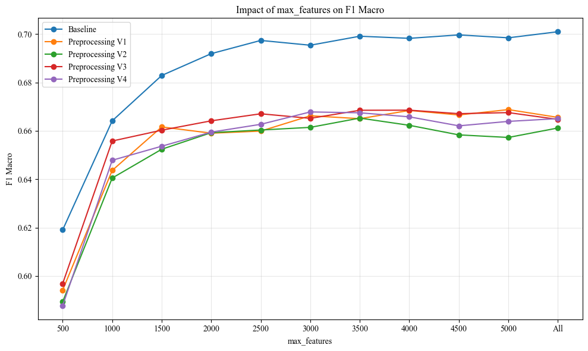

Wykres przedstawia zmianę wartości **F1 Macro w zależności od liczby cech (`max_features`)** dla różnych wariantów preprocessingu.

Dla wszystkich wariantów największy wzrost jakości następuje **pomiędzy 500 a 1500–2000 cech**.
Po przekroczeniu około 2500–3000 cech wyniki stabilizują się i **dalsze zwiększanie liczby cech daje niewielkie korzyści**.

---

## Eksperyment 2

| Model | Accuracy | F1-score (macro avg) | F1-score (weighted avg) | Precision (macro avg) | Precision (weighted avg) | Recall (macro avg) | Recall (weighted avg) |
|---|---:|---:|---:|---:|---:|---:|---:|
| Baseline | 0.76 | 0.70 | 0.76 | 0.78 | 0.76 | 0.65 | 0.76 |
| Bigram | 0.76 | 0.67 | 0.75 | 0.79 | 0.76 | 0.62 | 0.76 |
| Trigram | 0.75 | 0.64 | 0.74 | 0.79 | 0.76 | 0.59 | 0.75 |
| SVM | 0.77 | 0.73 | 0.77 | 0.77 | 0.77 | **0.70** | 0.77 |
| Bigram SVM | **0.78** | **0.74** | **0.78** | **0.80** | 0.78 | **0.70** | **0.78** |
| Trigram SVM | **0.78** | 0.73 | **0.78** | **0.80** | **0.79** | 0.69 | **0.78** |

Rozszerzenie reprezentacji TF-IDF o bigramy i trigramy **nie poprawiło wyników dla modeli opartych na `LogisticRegression`**. Wariant Bigram osiągnął niższy wynik (`F1 macro = 0.67`) niż baseline (`0.70`), a Trigram obniżył jakość jeszcze bardziej (`0.64`). Spadek dotyczył głównie Recall macro, co sugeruje, że modele gorzej rozpoznawały trudniejsze i mniej liczne klasy.

Znacznie lepsze rezultaty przyniosło zastosowanie `LinearSVM`. Już podstawowy wariant SVM osiągnął `F1 macro = 0.73,` wyraźnie przewyższając baseline. **Najlepsze wyniki uzyskał model Bigram SVM:**

- **Accuracy = 0.78,**
- **F1 macro = 0.74,**
- **Recall macro = 0.70.**

Pokazuje to, że **połączenie mocniejszego klasyfikatora z szerszym lokalnym kontekstem** pozwala lepiej rozpoznawać zależności pomiędzy słowami i poprawia klasyfikację trudniejszych przykładów.

Wariant Trigram SVM osiągnął bardzo podobne wyniki do Bigram SVM, jednak **bez dalszej poprawy F1 macro**. Sugeruje to, że wykorzystanie trigramów **zwiększa złożoność reprezentacji tekstu, ale nie wnosi już istotnej dodatkowej informacji** względem bigramów.

---

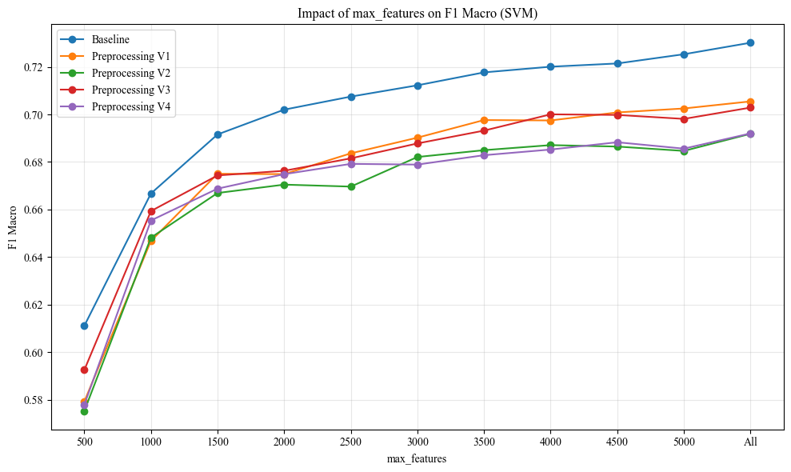

Wykres pokazuje wpływ liczby cech (`max_features`) na wartość `F1 Macro` dla wariantów preprocessingu wykorzystujących klasyfikator `LinearSVM`.

* Wszystkie warianty osiągają wyższe wyniki niż analogiczne modele z `Logistic Regression`, a baseline SVM przekracza `0.73 F1 Macro`.
* Największa poprawa jakości następuje do około `1500–2500` cech, po czym wyniki stabilizują się, a różnice między wariantami mocniejszego preprocessingu pozostają stosunkowo niewielkie.

---

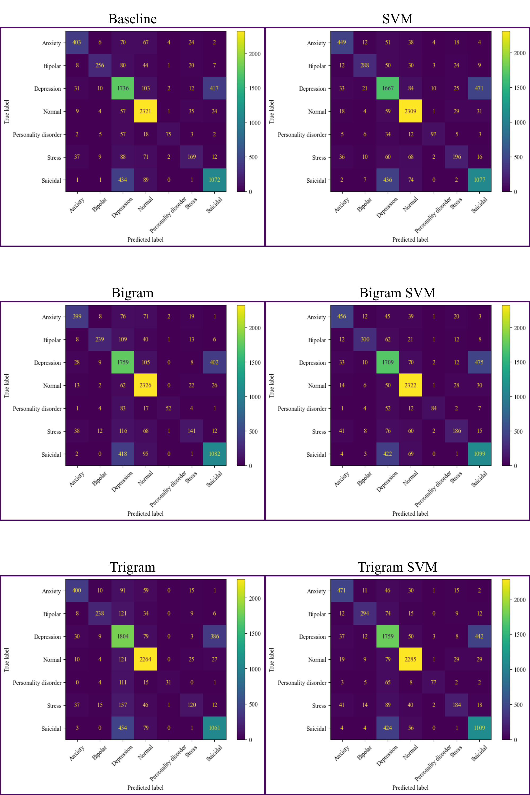

### Podobieństwa i różnice między modelami (na podstawie macierzy pomyłek)

* Wszystkie modele mają największy problem z rozróżnieniem klas `Depression` i `Suicidal`.

* Widoczne są również powtarzające się błędy między `Stress` a `Depression` oraz częściowo `Anxiety` i `Normal`.

* Modele `SVM` wyraźnie poprawiają rozpoznawanie klas: `Anxiety`,`Bipolar` oraz `Stress`. Widać to po większych wartościach na przekątnej oraz mniejszej liczbie pomyłek z `Normal` i `Depression`.

* Warianty `Bigram` i szczególnie `Trigram` bez SVM częściej nadmiernie przypisują klasę `Depression`.

* `Bigram SVM` oraz `Trigram SVM` najlepiej ograniczają klasyfikowanie `Anxiety` jako `Normal`, co sugeruje, że szerszy lokalny kontekst pomaga lepiej interpretować charakter wypowiedzi.

* Model trigramowy bez SVM ma tendencję do większego „rozmywania” klas — szczególnie widoczne jest to dla `Stress` oraz `Personality disorder`.

* Mimo różnic wszystkie modele nadal mają trudności głównie z klasami silnie powiązanymi emocjonalnie, szczególnie `Depression` i `Suicidal`.

## Eksperyment 3

| Metryka | Baseline | Max. 100 | Δ (Max. 100 − Baseline) | SVM | Max. 100 SVM | Δ (Max. 100 SVM − SVM) |
|---|---:|---:|---:|---:|---:|---:|
| Accuracy | 0.76 | 0.67 | -0.09 | 0.77 | 0.67 | -0.10 |
| **F1-score (macro avg)** | **0.70** | **0.58** | **-0.12** | **0.73** | **0.60** | **-0.13** |
| F1-score (weighted avg) | 0.76 | 0.66 | -0.10 | 0.77 | 0.66 | -0.11 |
| Precision (macro avg) | 0.78 | 0.74 | -0.04 | 0.77 | 0.68 | -0.09 |
| Precision (weighted avg) | 0.76 | 0.68 | -0.08 | 0.77 | 0.67 | -0.10 |
| Recall (macro avg) | 0.65 | 0.52 | -0.13 | 0.70 | 0.56 | -0.14 |
| Recall (weighted avg) | 0.76 | 0.67 | -0.09 | 0.77 | 0.67 | -0.10 |

Skrócenie wypowiedzi do maksymalnie 100 znaków spowodowało **wyraźny spadek jakości klasyfikacji dla obu modeli**. `F1 macro` obniżył się:
* z `0.70` do `0.58` dla `Logistic Regression`,
* z `0.73` do `0.60` dla `LinearSVC`.

Podobny spadek widoczny jest również dla `accuracy` oraz `Recall macro`.

---

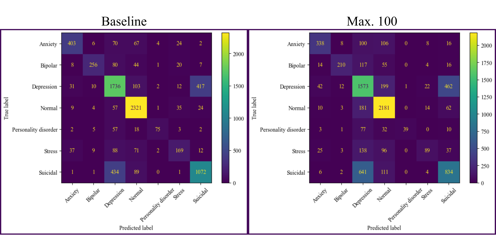

Porównanie macierzy pomyłek pokazuje, że po skróceniu tekstów modele znacznie **częściej przypisują przykłady do klasy `Depression`**.

Najbardziej widoczne zmiany to:
* wzrost pomyłek `Suicidal` → `Depression`,
* wzrost pomyłek `Stress` → `Depression`,
* wzrost pomyłek `Anxiety` → `Normal` i `Anxiety` → `Depression`,
* wyraźne pogorszenie rozpoznawania `Personality disorder`.

Jednocześnie liczba poprawnie rozpoznanych przykładów (wartości na przekątnej) **spada praktycznie dla wszystkich klas**. Pokazuje to, że **krótkie fragmenty tekstu często nie zawierają wystarczającej liczby sygnałów emocjonalnych pozwalających na poprawną klasyfikację**.

---

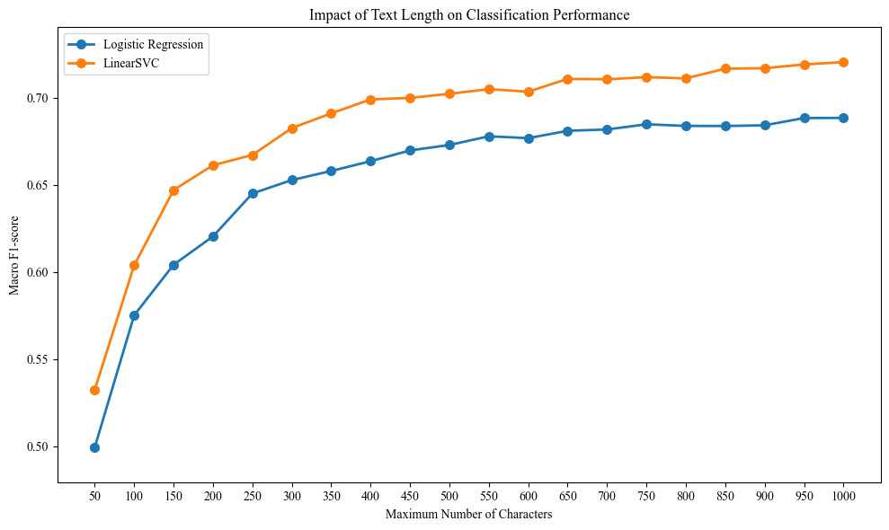

Wraz ze wzrostem maksymalnej długości tekstu jakość klasyfikacji systematycznie rośnie dla obu modeli. Największa poprawa następuje **pomiędzy 50 a 300 znakami**, natomiast po przekroczeniu około 500–700 znaków wzrost jakości **wyraźnie się stabilizuje**.

---

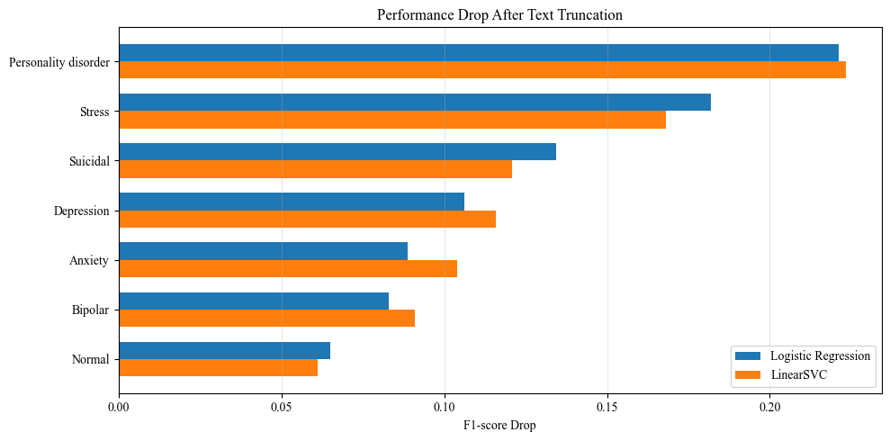

Wykres spadku F1-score pokazuje, że najbardziej cierpią klasy **słabo reprezentowane lub o dużej średnij długości tekstu**:

* Personality disorder,
* Stress,
* Suicidal.

Najmniejszy wpływ skracania tekstu widoczny jest dla klasy `Normal`, która jest najczęstsza, i **średnia długość tekstu dla niej jest poniżej 100**.

**Dodatnia korelacja** między średnią długością tekstu a spadkiem jakości po truncation:
- dla modelu opartego o `LogisticRegression`: **0.404**
- dla modelu opartego o `LinearSVC`: **0.514**

sugeruje, że klasy o dłuższych wypowiedziach są bardziej zależne od szerszego kontekstu i silniej tracą na skracaniu tekstu.

---

## Eksperyment 4

| Model | Precision (Normal) | Recall (Normal) | F1-score (Normal) |
|---|---:|---:|---:|
| Baseline | 0.86 | **0.95** | 0.90 |
| Binary | **0.91** | 0.91 | **0.91** |
| SVM | 0.88 | **0.94** | 0.91 |
| Binary SVM | **0.92** | 0.91 | **0.92** |
| Bigram SVM | 0.90 | **0.95** | 0.92 |
| Binary Bigram SVM | **0.94** | 0.91 | 0.92 |

Modele stworzone specjalnie do odróżniania klasy `Normal` od pozostałycj mają wyższe `precision` i (zwykle też `f1-score`). Jednak odbywa się to kosztem spadku `recall` względem klasyfikacji wieloklasowej. Zatem te warianty **są zbyt „ostrożne”** w przypisywaniu wpisów do klasy bezproblemowej.

---

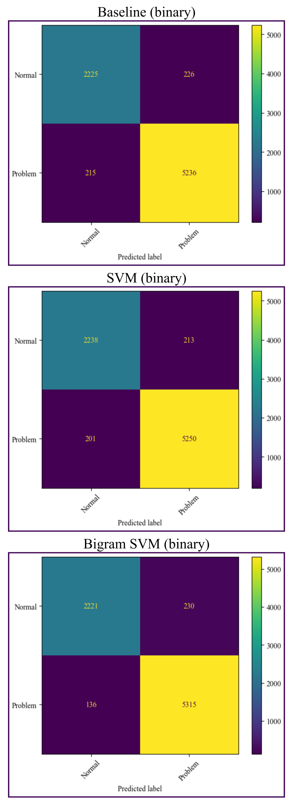

Macierze pomyłek pokazują, że **wszystkie modele stosunkowo dobrze rozróżniają teksty neutralne od problemowych**. Najważniejsze obserwacje:
* Binary Bigram SVM najlepiej ogranicza liczbę przypadków *Problem* → *Normal*, ale równocześnie najbardziej zwiększa liczbę pomyłek przeciwnych
* modele SVM generują mniej fałszywych negatywów niż baseline.

---

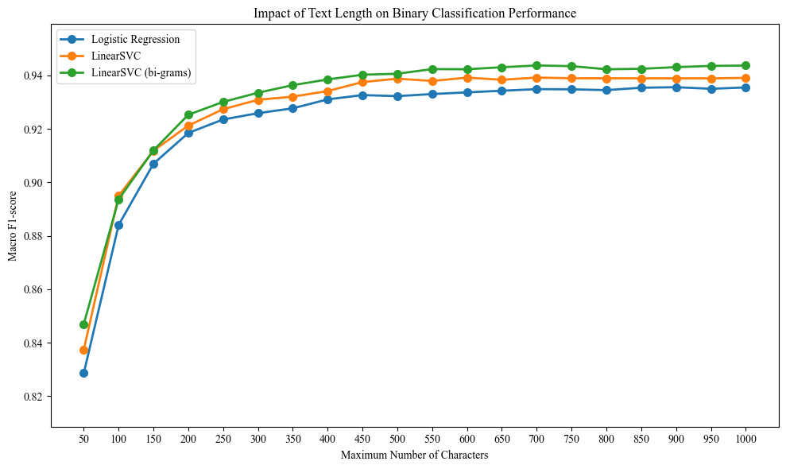

Wykres pokazuje, że klasyfikacja binarna jest znacznie mniej wrażliwa na skracanie tekstu niż klasyfikacja wieloklasowa. Oznacza to, że do wykrycia samej obecności problemu emocjonalnego wystarcza stosunkowo krótki fragment tekstu, natomiast **rozróżnienie konkretnych klas problemu wymaga znacznie szerszego kontekstu**.

---

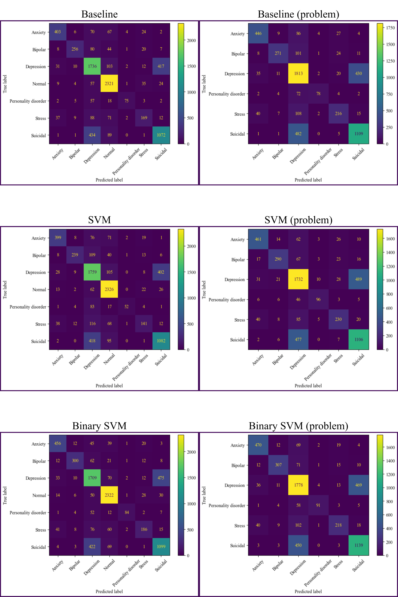

Porównanie macierzy pomyłek pokazuje, że wcześniejsze oddzielenie klasy `Normal` **poprawia rozpoznawanie części klas problemowych**. Największa poprawa widoczna jest dla:
* `Stress`,
* `Personality disorder`,
* częściowo `Anxiety` i `Bipolar`.

Modele „problemowe” nie mogą pomylić wpisów emocjonalnych z klasą `Normal`, dzięki czemu więcej przykładów trafia do właściwych kategorii. **Jednocześnie nadal utrzymuje się główny problem datasetu — bardzo częste pomyłki między `Depression` i `Suicidal`**.

--- 

| Metryka | Baseline | Hier. | Δ (Hier. − Baseline) | SVM | Hier. SVM | Δ (Hier. SVM − SVM) | Bigram SVM | Hier. Bigram SVM | Δ (Hier. Bigram SVM − Bigram SVM) |
|---|---:|---:|---:|---:|---:|---:|---:|---:|---:|
| Accuracy | 0.76 | 0.76 | 0.00 | 0.77 | 0.76 | -0.01 | 0.78 | 0.78 | 0.00 |
| **F1-score (macro avg)** | **0.70** | **0.71** | **+0.01** | **0.73** | **0.72** | **-0.01** | **0.74** | **0.74** | **0.00** |
| F1-score (weighted avg) | 0.76 | 0.76 | 0.00 | 0.77 | 0.76 | -0.01 | 0.78 | 0.78 | 0.00 |
| Precision (macro avg) | 0.78 | 0.78 | 0.00 | 0.77 | 0.76 | -0.01 | 0.80 | 0.79 | -0.01 |
| Precision (weighted avg) | 0.76 | 0.77 | +0.01 | 0.77 | 0.77 | 0.00 | 0.78 | 0.78 | 0.00 |
| Recall (macro avg) | 0.65 | 0.67 | +0.02 | 0.70 | 0.70 | 0.00 | 0.70 | 0.71 | +0.01 |
| Recall (weighted avg) | 0.76 | 0.76 | 0.00 | 0.77 | 0.76 | -0.01 | 0.78 | 0.78 | 0.00 |

Wyniki pokazują, że klasyfikacja hierarchiczna **nie prowadzi do dużych zmian jakości** względem klasyfikacji bezpośredniej. Różnice dla większości metryk pozostają bardzo niewielkie (`±0.00–0.02`).

Największą poprawę po zastosowaniu podejścia hierarchicznego uzyskał baseline:
* `F1 macro` wzrósł z `0.70` do `0.71`,
* `Recall` macro wzrósł z `0.65` do `0.67`.
Dla modeli SVM wpływ klasyfikacji hierarchicznej był znacznie mniejszy, a nawet lekko negatywny.

___

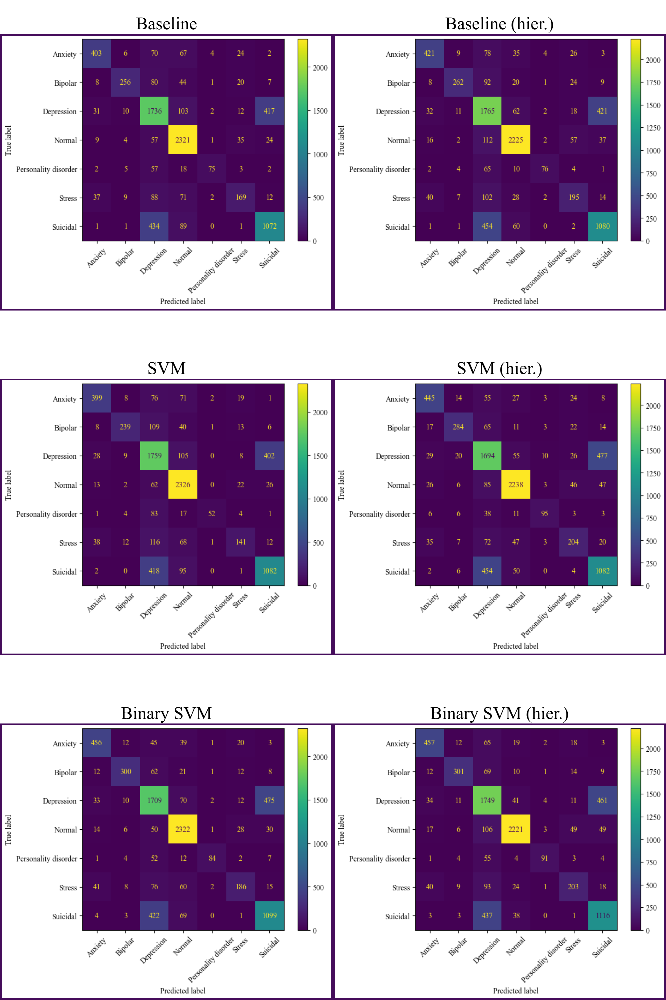

Porównanie wariantów bezpośrednich i hierarchicznych pokazuje, że podejście hierarchiczne **częściowo poprawia rozpoznawanie klas problemowych**, szczególnie:
* `Stress`,
* `Anxiety`,
* `Personality disorder`.
Jednak odbywa się to kosztem mniejszej liczby przykładów klasyfikowanych poprawnie jako `Normal`, co wynika z niższego `recall` dla tej kategorii w wypadku klasyfikacji binarnej. 

Ostatecznie i tak we wszystkich przypadkach największe problemy nadal wynikają z nakładania się klas problemowych, szczególnie `Depression` i `Suicidal`.

## Wyniki na zbiorze testowym (baseline vs. najlepszy model)

| Metryka | Baseline | Bigram SVM | Δ (Bigram SVM − Baseline) |
|---|---:|---:|---:|
| Accuracy | 0.77 | 0.79 | +0.02 |
| **F1-score (macro avg)** | **0.71** | **0.76** | **+0.05** |
| F1-score (weighted avg) | 0.77 | 0.79 | +0.02 |
| Precision (macro avg) | 0.79 | 0.82 | +0.03 |
| Precision (weighted avg) | 0.77 | 0.79 | +0.02 |
| Recall (macro avg) | 0.66 | 0.73 | +0.07 |
| Recall (weighted avg) | 0.77 | 0.79 | +0.02 |

Ocena na zbiorze testowym potwierdza obserwacje z wcześniejszych eksperymentów walidacyjnych — model **Bigram SVM wyraźnie przewyższa baseline** praktycznie dla wszystkich metryk.

Najważniejsze różnice względem baseline’u:
* `F1 macro` wzrósł z o `0.05`,
* Recall macro wzrósł z `0.66` do `0.73`,
* `Accuracy` wzrosło z `0.77` do `0.79`.

Największa poprawa widoczna jest właśnie dla Recall macro, co oznacza, że model **lepiej rozpoznaje trudniejsze i mniej liczne klasy, zamiast nadmiernie preferować klasy dominujące**.

---

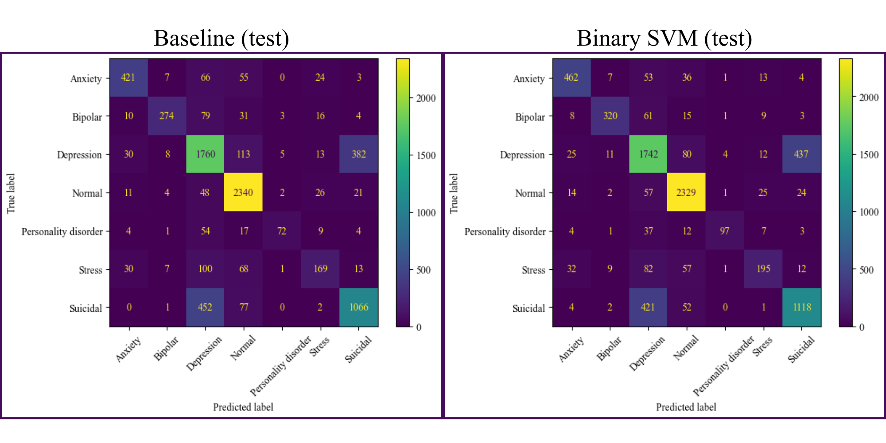

Macierze pomyłek pokazują, że Bigram SVM:
* zwiększa liczbę poprawnych klasyfikacji praktycznie dla wszystkich klas,
* ogranicza pomyłki `Stress` → `Depression`,
* poprawia rozpoznawanie `Bipolar`,
* zmniejsza liczbę błędów `Anxiety` → `Normal`.

**Największy problem pozostaje jednak niezmienny**: bardzo częste pomyłki między `Depression` i `Suicidal`.

Mimo poprawy jakości model **nadal ma trudność z rozróżnianiem klas silnie powiązanych emocjonalnie**, co potwierdza wcześniejsze obserwacje dotyczące charakteru datasetu.

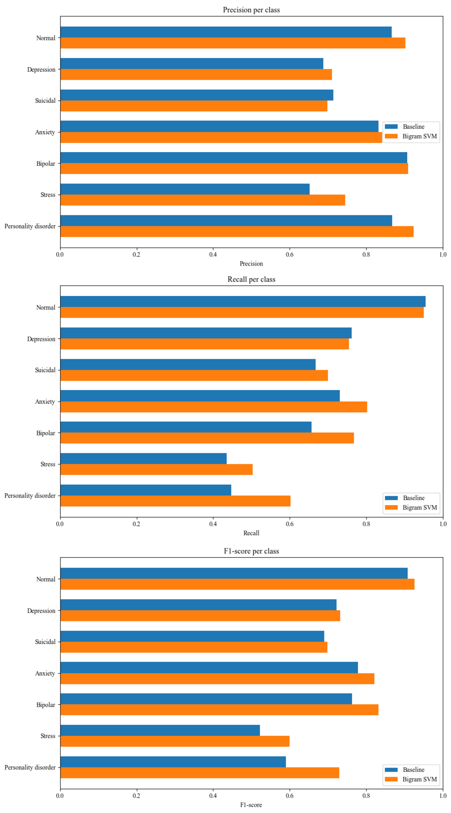

Porównanie wyników dla poszczególnych klas pokazuje, że Bigram SVM **poprawia jakość klasyfikacji niemal dla wszystkich kategorii**.

Największe zyski widoczne są dla:
* `Stress`,
* `Personality disorder`,
* `Bipolar` (z wyjątkiem prawie idyntycznego precision).

Szczególnie istotna jest poprawa Recall dla klas słabiej reprezentowanych, co sugeruje, że model lepiej wykorzystuje lokalny kontekst i **rzadziej „ucieka” do dominujących klas takich jak `Depression` lub `Normal`**.